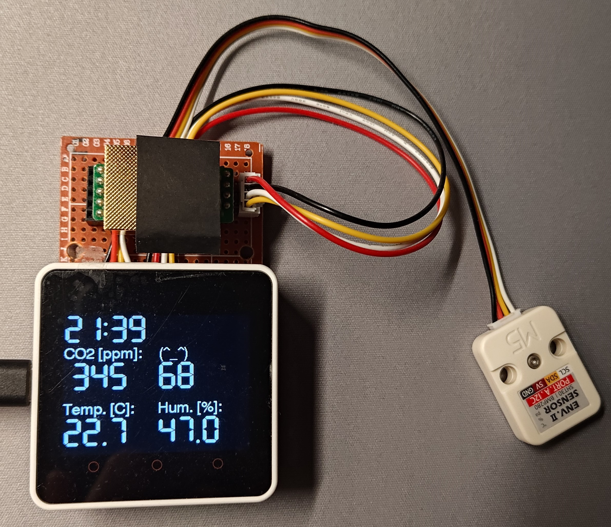
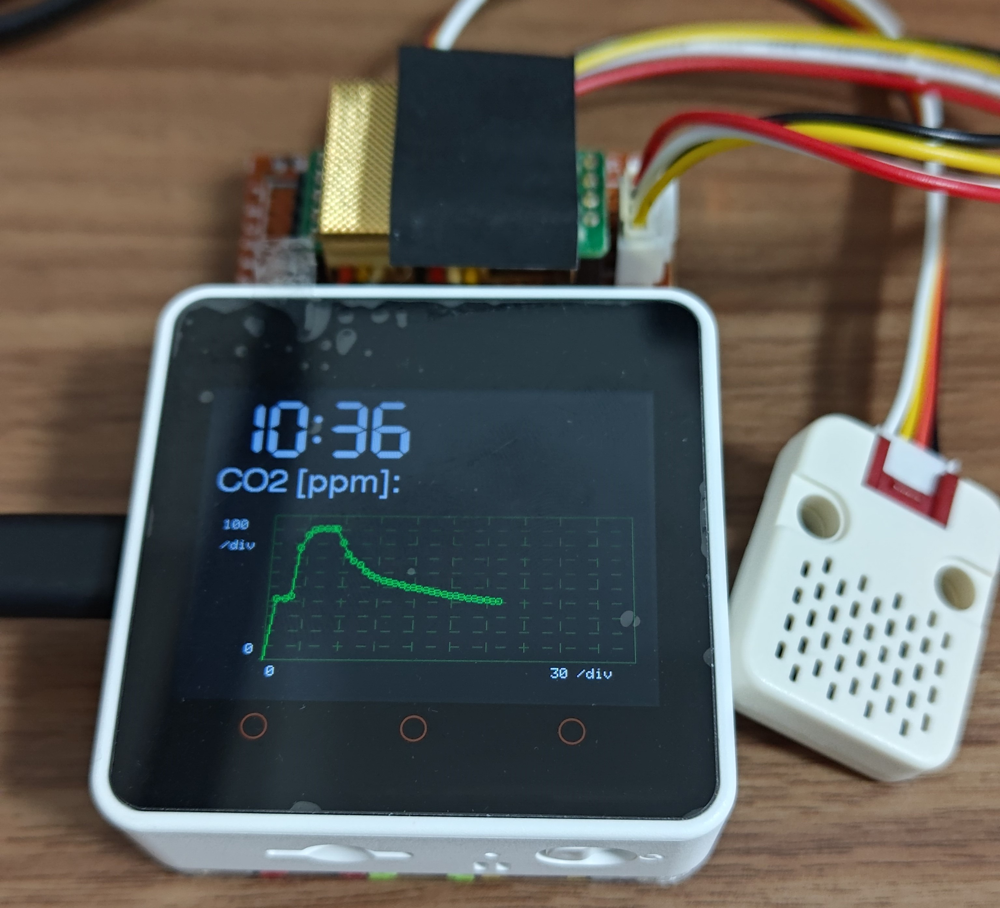

# Ambient Monitoring with M5Stack

This project is about creating an ambient monitoring system using the M5Stack. It measures and displays various environmental parameters, including:

- CO2 Concentration
- Discomfort Index
- Temperature
- Humidity

## Features

### Indicator Mode
Displays the current environmental conditions using an easy-to-understand visual indicator.

### Real-Time Wavechart Mode
Shows the fluctuations of the measured parameters over time in a wavechart format for real-time monitoring.

## Hardware Components

- **M5Stack Core2**: The main controller used for processing and display.
- **SHT3X**: A sensor for measuring temperature and humidity.
- **MH-Z19C**: A sensor for measuring CO2 concentration.

## Software and Development Tools

This project was developed using [PlatformIO](https://platformio.org/), an open-source ecosystem for IoT development. PlatformIO provides a powerful platform for developing with the M5Stack, including library management, development tools, and support for various frameworks and languages.

## License
MIT Lisense
